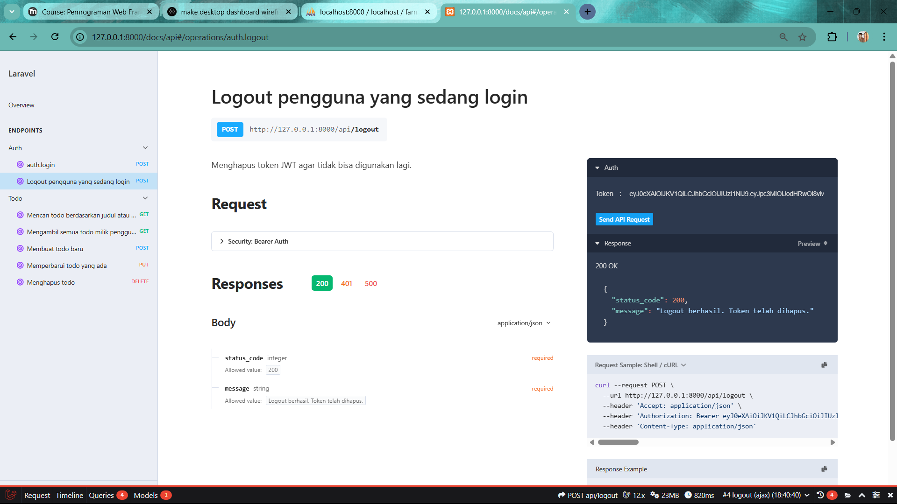
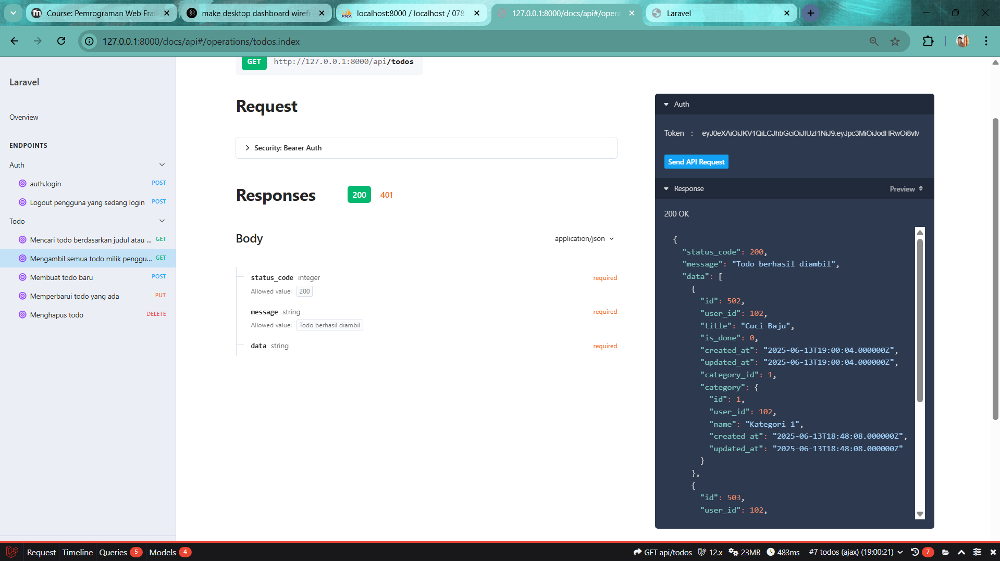
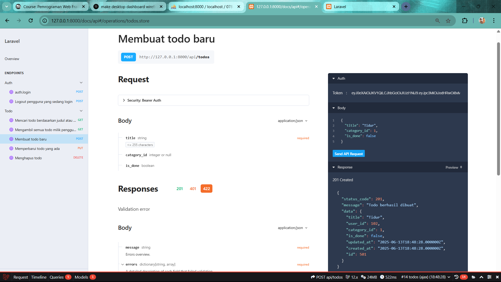
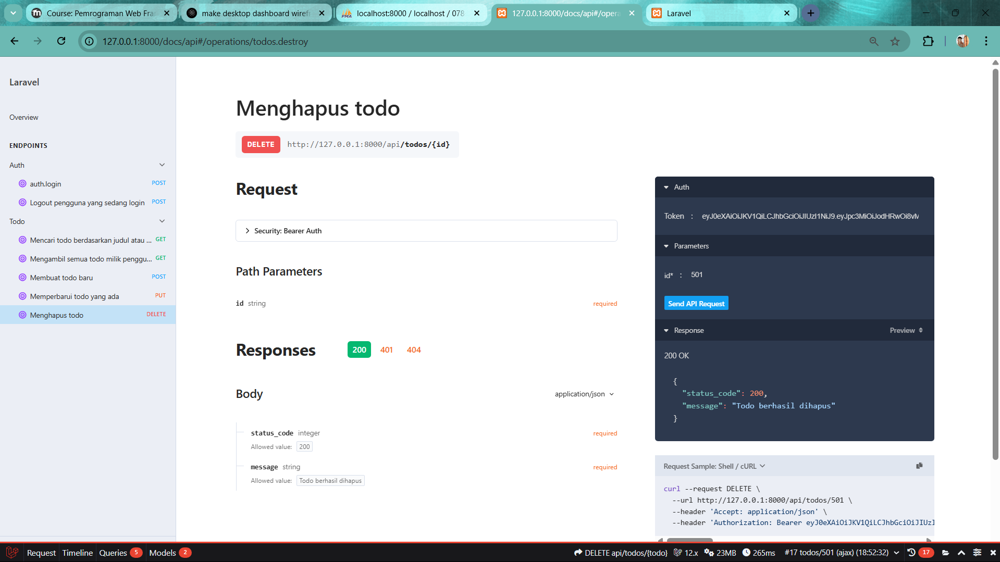
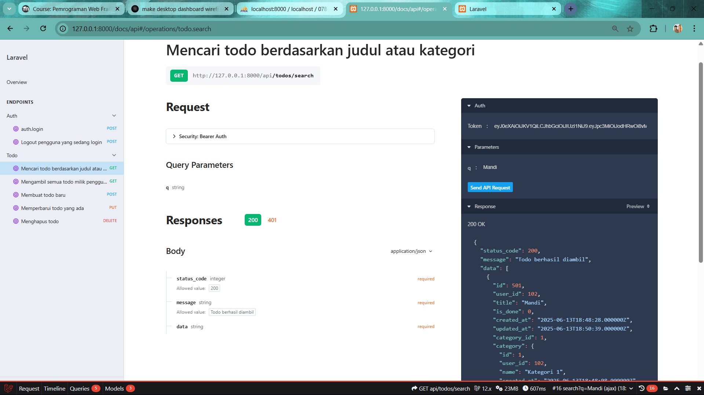

# Tugas 12

# Endpoint Logout

# Endpoint untuk mengambil semua data Todo 

# Endpoint untuk menambah data Todo baru

# Endpoint untuk mengubah Todo

# Endpoint untuk menghapus Todo

# Endpoint untuk melakukan pencarian pada Todo
